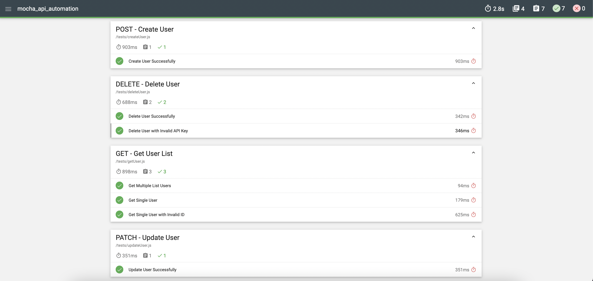

# 🚀 ReqRes API Automation Tests

Automated API Testing project for [**ReqRes API**](https://reqres.in) using **Mocha**, **Chai**, and **Mochawesome** reporting.

## 📋 Overview

This project automates end-to-end API tests for the ReqRes service, focusing on:

- ✅ User creation (POST) functionality
- ✅ User retrieval (GET) operations
- ✅ User modification (PATCH) capabilities
- ✅ User deletion (DELETE) processes
- ✅ Error handling and validation
- ✅ Professional HTML reporting with Mochawesome

## 📁 Project Structure

```
mocha_api_automation/
│
├── tests/
│   ├── createUser.js                        # User creation tests
│   ├── getUser.js                           # User retrieval tests
│   ├── updateUser.js                        # User modification tests
│   └── deleteUser.js                        # User deletion tests
│
├── images/
│   └── test-report.png                      # Test report screenshot
│
├── package.json                             # Project metadata & npm scripts
├── package-lock.json
└── README.md                                # Project documentation
```

## ⚙️ Tech Stack

| Tool            | Purpose                                  |
| :-------------- | :--------------------------------------- |
| **JavaScript**  | Test scripting language                  |
| **Mocha**       | Test framework for Node.js               |
| **Chai**        | BDD assertion library                    |
| **Mochawesome** | Professional HTML & JSON reporting       |
| **Node.js**     | JavaScript runtime environment           |
| **ReqRes API**  | RESTful API service for testing          |

## 🚀 How to Run the Tests

**Clone the repository:**

```bash
git clone <repository-url>
cd mocha_api_automation
```

**Install dependencies:**

```bash
npm install
```

**Run all tests:**

```bash
npm run tests
```

**Run individual test suites:**

```bash
# User creation functionality tests
npm run tests:createUser

# User retrieval functionality tests
npm run tests:getUser

# User modification functionality tests
npm run tests:updateUser

# User deletion functionality tests
npm run tests:deleteUser
```

## 📈 Test Results

**7 tests passed - 100% success rate**

| Method | Test Case          | Endpoint            | Status |
| :----- | :----------------- | :------------------ | :----- |
| POST   | Create User        | `/api/users`        | ✅ PASS |
| GET    | Get Multiple Users | `/api/users?page=2` | ✅ PASS |
| GET    | Get Single User    | `/api/users/2`      | ✅ PASS |
| GET    | Invalid User ID    | `/api/users/elsa`   | ✅ PASS |
| PATCH  | Update User        | `/api/users/2`      | ✅ PASS |
| DELETE | Delete User        | `/api/users/2`      | ✅ PASS |
| DELETE | Invalid API Key    | `/api/users/`       | ✅ PASS |

## 📈 Test Report Screenshot

Below is an example of the generated Mochawesome report after running the tests:



The report includes detailed logs, assertions, and pass/fail status for each test case.

## 🧠 Key Learning Points

- RESTful API testing with different HTTP methods (GET, POST, PATCH, DELETE)
- Async/await pattern for handling API requests
- Chai assertion library for test validation
- Error handling and edge case testing
- Professional test reporting with Mochawesome
- JSON response validation and data extraction
- API endpoint testing best practices

## 👩🏻‍💻 Author

**Elsa Farah Fauzia**  
_Senior Software Quality Assurance_  
📍 Jakarta, Indonesia

🔗 [LinkedIn](https://www.linkedin.com/in/elsafarahfauzia/) | [GitHub](https://github.com/elsafarahhf)
